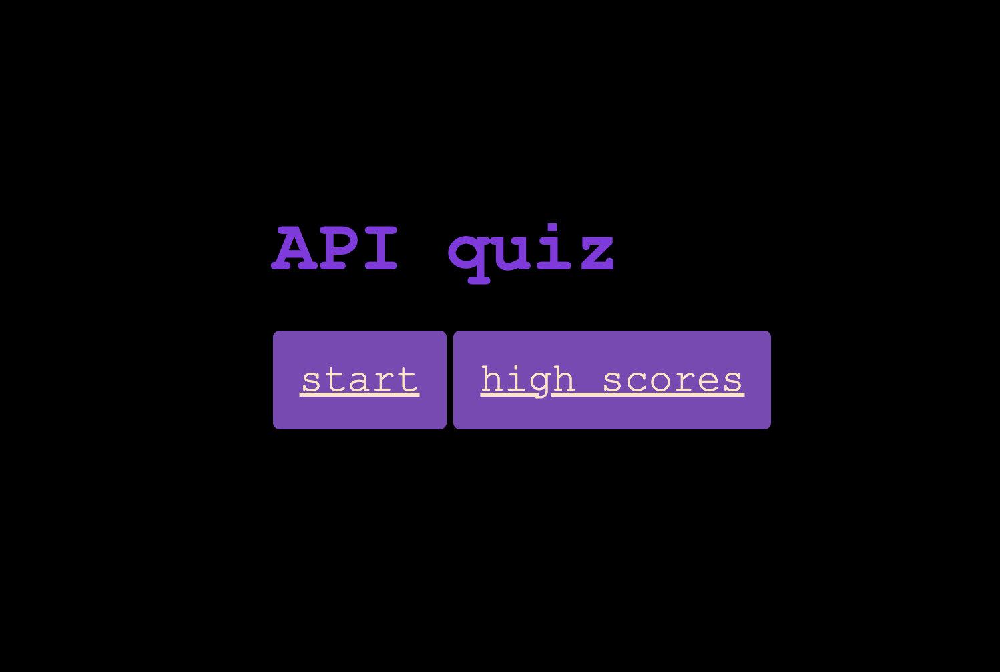

# APIs-Code-Quiz

## Description

This project is a basic quiz. When you are on the home page and click "start" you are prompted with a series of questions. 

After each question is answered your score will be recorded in the top right.

When the quiz is complete you will be taken to a scoring page where you can save your initials. From this page you can take the quiz again or go home to view high scores.

## Screen shot

### Link

https://github.com/mmontoya1112/APIs-Code-Quiz
